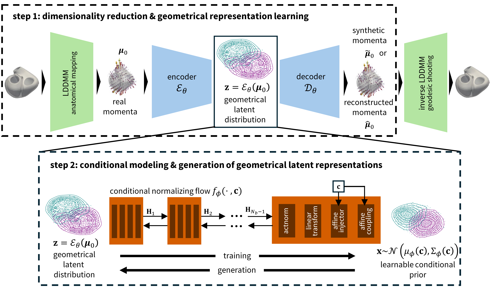

# CAN-FLOW: Flow-based conditional cardiac anatomy generation for virtual cohorts

This repository is the official implementation of the paper
> **"Flow-based conditional cardiac anatomy generation for virtual cohorts"**
> 
> *Konstantinos Kevopoulos, Beatrice Moscoloni, Benjamin Alheit, Cameron Beeche, Julio A. Chirinos, Alexander Heinlein, Mathias Peirlinck*

CAN-FLOW is a **conditional generative model of cardiac anatomy**, based on normalizing flows and diffeomorphisms. This generative modeling approach consists of two steps. 
In the first step, CAN-FLOW learns geometry-only latent representations of diffeomorphic cardiac shape momenta. As a second step, the sex-, age-, and body-mass-index-dependent distribution of those latent representations
is modelled with a conditional normalizing flow. We refer to the sex, age, and BMI conditioning information as **the metadata**. 

When using, please cite:

~~~bibtex
@article{kevopoulos2026flow,
  title={Flow-based conditional cardiac anatomy generation for virtual cohorts},
  author={Kevopoulos, Konstantinos and Moscoloni, Beatrice and Alheit, Benjamin and Beeche, Cameron and Chirinos, Julio A and Heinlein, Alexander and Peirlinck, Mathias},
  doi={10.48550/arXiv.2608.09460}
  journal={arXiv preprint arXiv:2608.09460},
  year={2026}
}
~~~
## Contents

This repository contains:
- Examples of synthetic virtual cohorts of biventricular anatomies for subjects with different metadata characteristics 
- The architecture of the CAN-FLOW generative model, and the cVAE used as a baseline for comparison (for details, we refer the reader to the [manuscript](https://arxiv.org/pdf/2608.09460))
- Illustrative script to showcase how to train CAN-FLOW
- Illustrative script to showcase how to generate synthetic cardiac anatomies according to sex, age, and BMI, using a trained instance of CAN-FLOW

## How to use:
To train and use the CAN-FLOW generative model, the user should have access to a dataset of cardiac anatomies, and the corresponding metadata. 
For this version of the model, the anatomical representation should be the subject-specific 3D momenta vector field obtained by the *anatomical mapping of LDDMM, implemented in [Deformetrica](https://gitlab.com/icm-institute/aramislab/deformetrica/)*.

### Example of synthetic virtual subcohorts of the overall population
In this repository, **we provide synthetic virtual cohorts of cardiac anatomies**, for subpopulations of different metadata characteristics.

For females and males, we define the following 3 bins of age and BMI:

* **Age:** `[50, 60]`, `[60, 70]`, `[70, 80]`
* **BMI:** `[17, 21]`, `[21, 25]`, `[25, 29]`

Each age bin is combined with all three BMI bins, resulting in:

* 3 age bins × 3 BMI bins = 9 cohorts per sex
* 9 cohorts × 2 sexes = **18 cohorts in total**

For each cohort, we generate **20 synthetic cardiac (biventricular) anatomies** using CAN-FLOW, resulting in **360 synthetic anatomies** overall.

The corresponding synthetic surface meshes are available in [`synthetic_example_cohorts.zip`](synthetic_example_cohorts.zip).

**If you are interested in larger synthetic cohorts or cohorts conditioned on specific metadata configurations, please feel free to contact us. 
We would be happy to generate additional cohorts tailored to your use case.**

### Training
Input to CAN-FLOW should be the momenta representations and the metadata.

- If we encode each anatomy with 720 momenta vectors, the first input is a `torch.tensor` with dimensions `(num_anatomies, 720, 3)`. We reshape the tensor to another one with dimensions `(num_anatomies, 3, 8, 9, 10)`. This is given as input to the convolutional autoencoder as the first step of the training. After training the autoencoder, the latent representations are in a `torch.tensor` with dimension`(num_anatomies, 44)`, where 44 is the chosen latent dimensionality. This is then given as input to the normalizing flow, along with the metadata.  

- The metadata input to the normalizing flow is a `torch.tensor`  with dimensions `(num_anatomies, 4)`. One metadata instance is `[BMI, age, sex_female, sex_male]`, where we one-hot-encode females and males as explained in the manuscript.

In the [`\train`](train) folder, we provide the training scripts we used to train the autoencoder and normalizing flow. However, small modifications of those scripts by the user are also acceptable. 

### Generation 
In its current version, the model generates synthetic 3D momenta vectors, not meshes directly.The synthetic momenta should be transformed to synthetic anatomies using **Deformetrica's *geodesic shooting* process**.
This step has to be performed by the user and is not included in the repository. As with training, the generation includes **two steps**:

1. We give the desired metadata (`torch.tensor`  with dimensions `(num_subjects, 4)`) as input to the trained normalizing flow. The flow then generates synthetic latent representations.
2. We decode the latent representations using the trained decoder, and obtain synthetic 3D momenta (`torch.tensor` with dimensions `(num_anatomies, 3, 8, 9, 10)`). We reshape the output to dimensions (`(num_anatomies, 720, 3)`), write it in `.txt` file, and perform [Deformetrica's geodesic shooting](https://gitlab.com/icm-institute/aramislab/deformetrica/-/blob/master/deformetrica/core/models/geodesic_regression.py?ref_type=heads).

We provide a simple code example on how to sample synthetic metadata and generate synthetic 3D momenta using CAN-FLOW [in this folder](synthetic_example_dataset_generation). 

## Note

CAN-FLOW is not limited to the anatomical setting and representation used in this repository. 
The framework can also be adapted to other anatomical structures, such as **monoventricular or atrial anatomies**.

CAN-FLOW is also not restricted to **LDDMM momenta**. The architecture can be adapted to alternative geometric representations, such as **point clouds**. Depending on the representation, the convolutional layers of the autoencoder may need to be modified accordingly.

If you are working with a different anatomical representation, or if you have questions about adapting CAN-FLOW to a new geometry or data format, please feel free to contact us. We are happy to discuss possible extensions and help with adapting the framework to your use case.

## Contact

For questions, suggestions, or collaborations, please contact:

**Konstantinos Kevopoulos**                                                                                                                                                                                                              
*Department of BioMechanical Engineering, Delft University of Technology, Delft, The Netherlands*                                                             
k.kevopoulos at tudelft nl 

**Mathias Peirlinck**  
*Department of BioMechanical Engineering, Delft University of Technology, Delft, The Netherlands*  
mplab-me at tudelft nl
